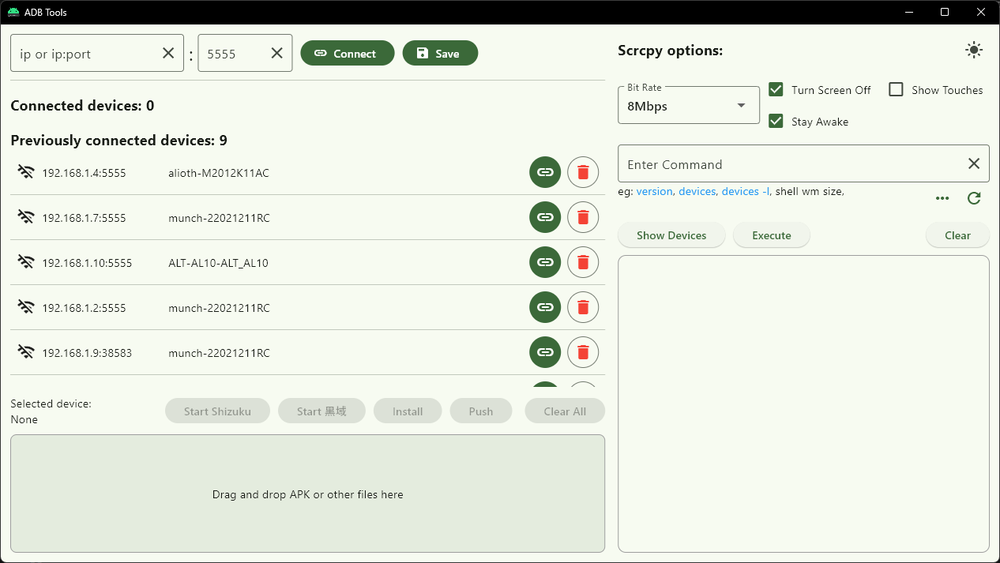
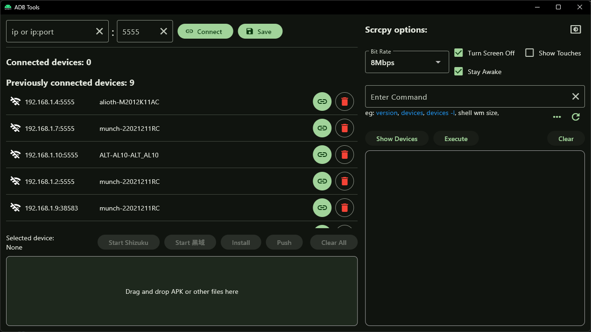

# ADB Tools

一个简单的 Adb 和 Scrcpy 图形化工具

## 实现功能

* [通过 wifi 连接安卓设备](https://developer.android.google.cn/tools/adb?hl=zh_cn#wireless-android11-command-line)，并保存连接过的设备 ip，下次可直接连接
* 使用 [Scrcpy](https://github.com/Genymobile/scrcpy) 投屏安卓设备屏幕
* 安装 apk 文件至已连接设备
* 传输文件至已连接设备
* 一键[启动 Shizuku](https://shizuku.rikka.app/zh-hans/guide/setup/#%E5%90%AF%E5%8A%A8-shizuku-3)
* 收录常用 adb 命令，可一键执行。比如：adb shell vm size、adb shell getprop service.adb.tcp.port

## 开发环境

- [adb](https://developer.android.com/tools/releases/platform-tools) Version: 1.0.41
- [scrcpy](https://github.com/Genymobile/scrcpy) Version: [v3.2](https://github.com/Genymobile/scrcpy/releases/tag/v3.2)

## 软件截图

### 主界面

### 命令执行输出界面

## 随便聊聊

这个项目最初是为了解决每次电脑连接安卓设备时复杂的操作步骤。每次电脑连接手机需要插数据线，主机位置很不方便插数据线；使用 Wifi 连接手机又记不到 ip 地址，又要到设置里找 ip 地址，然后打开命令行输入 ip 连接。

灵感来源于[ADB Wi-Fi](https://github.com/y-polek/ADB-Wi-Fi)，这是一个 Android Studio 插件，它会记住通过 Wifi 连接过的设备 ip，下次连接直接点击 "Connect" 就好。

其他功能都是后面在使用过程中，遇到的方便自己的操作，就添加到这个项目里。