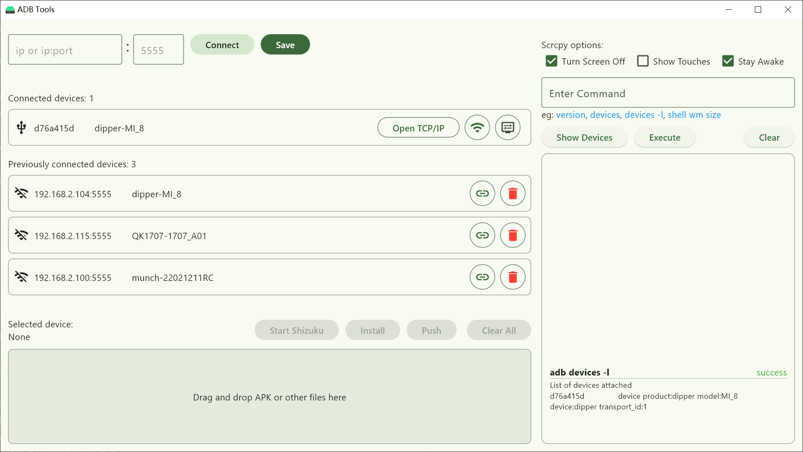

# ADB Tools

A simple GUI for ADB.

## Environment

- [adb](https://developer.android.com/tools/releases/platform-tools) Version: 1.0.41
- [scrcpy](https://github.com/Genymobile/scrcpy) Version: [v3.2](https://github.com/Genymobile/scrcpy/releases/tag/v3.2)

## Screenshot

### Main Window

### Output Screen

